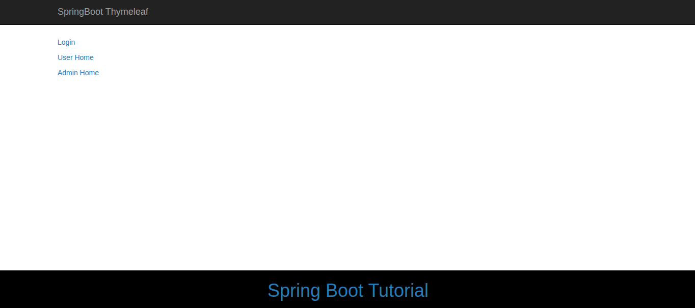
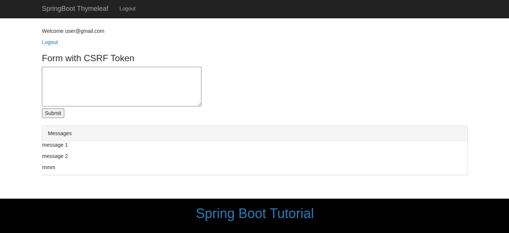
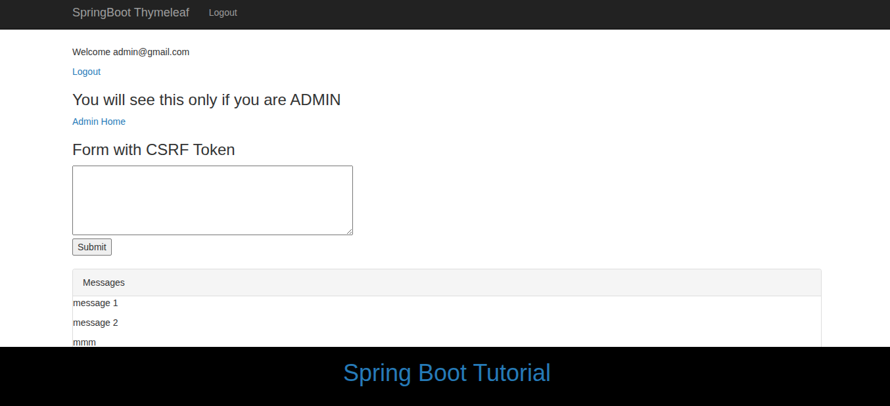
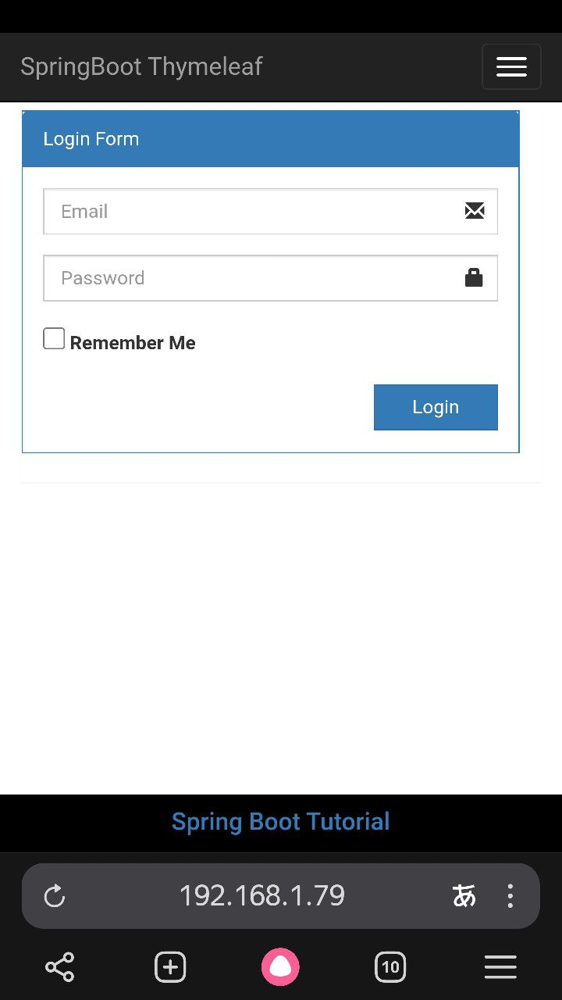
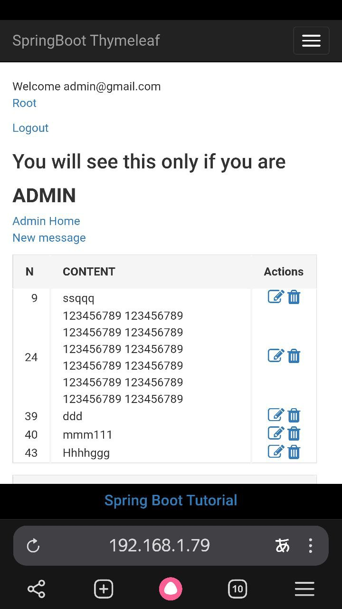
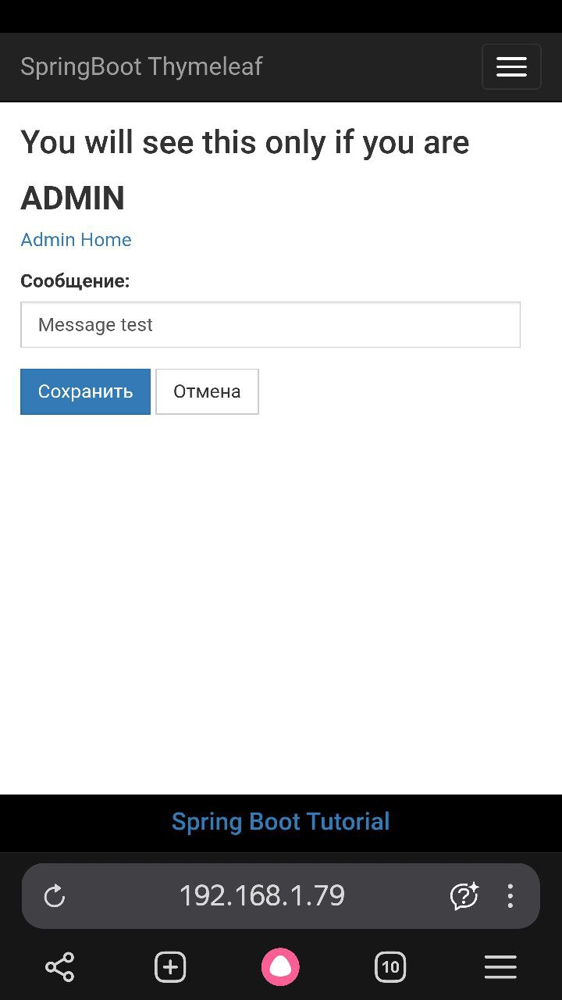

# Demo. Spring Boot + Spring MVC + Role Based Spring Security + Hibernate + Thymeleaf + MySQL

**springboot-thymeleaf-security-demo**: This tutorial demonstrates how to secure a SpringBoot +Thymeleaf based web application using Spring Security.

#### How to run?

Java 8

````shell
export JAVA_HOME=/usr/lib/jvm/java-8-openjdk-amd64
````

````shell
./mvnw spring-boot:run
````

Go to [http://localhost:8080/](http://localhost:8080/)

Login: admin@gmail.com Pass: admin 

Login: user@gmail.com  Pass: user

Blog post - [https://www.javaguides.net/2018/09/spring-boot-spring-mvc-role-based-spring-security-jpa-thymeleaf-mysql-tutorial.html](https://www.javaguides.net/2018/09/spring-boot-spring-mvc-role-based-spring-security-jpa-thymeleaf-mysql-tutorial.html)

#### Screens

__Not__ logged:



For __user__ login:



for __admin__ login (added string __"You will see this only if you are ADMIN"__):
 


[userhome.html](src/main/resources/templates/userhome.html) (line 20):

````html
<div sec:authorize="hasRole('ROLE_ADMIN')">
    <h3>You will see this only if you are <b>ADMIN</b></h3>
    <p>
        <a th:href="@{/admin/home}">Admin Home</a>
    </p>
</div>
````

### Mobile screens





### Link action form to java code

Form:

link: th:action="@{/messages}" method="post"

````html
		<h3>Write a message:</h3>
		<form th:action="@{/messages}" method="post"> // <--- POST /messages
			<textarea name="content" cols="50" rows="3"></textarea>
			<br>
			<input class="btn btn-primary" type="submit" value="Submit" />
		</form>

````

Handler in Java code (@PostMapping("/messages")):

@PostMapping(value = "/new_message")<br/>
value = "content"<br/>

````java
@Controller
public class HomeController {
    @PostMapping(value = "/new_message")
    public String newMessage(@RequestParam(defaultValue = "----", value = "content") String newContent) {
        ...
    }
}
````

### Links

- [thymeleaf](https://www.thymeleaf.org/doc/tutorials/3.0/usingthymeleaf.html)


TODO:
- tests
- padding messages
- delete message
- 